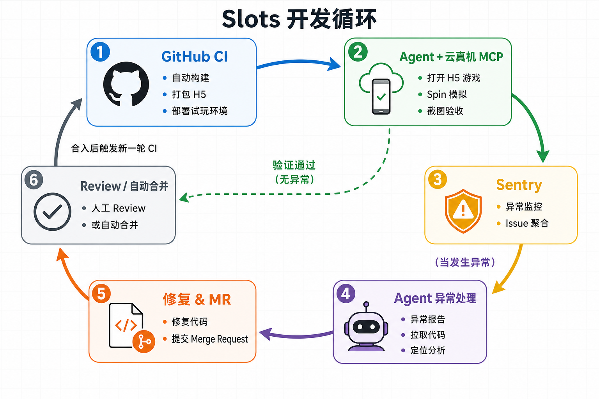
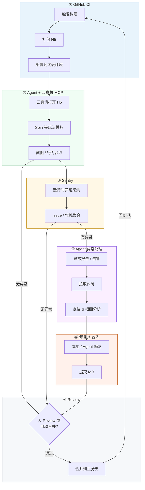
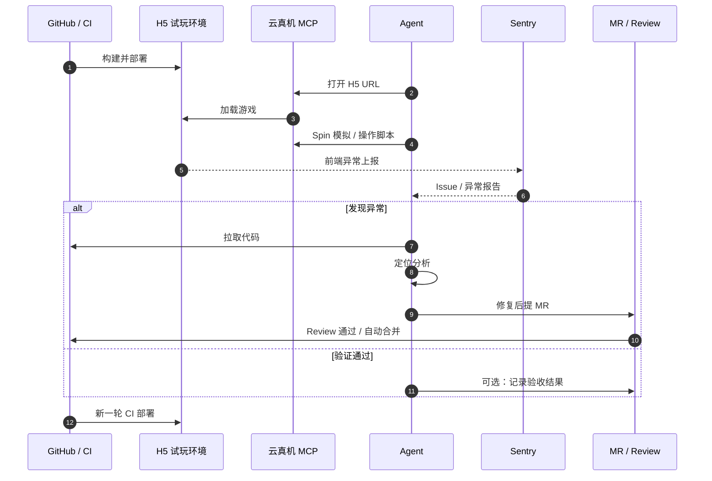

# Slots 开发循环

试玩 H5（Slots）从构建、云真机自动化验证、异常监控到修复合入的闭环流程。

## 总览循环（Mermaid 源码）

## 时序视角（单轮迭代）

## 步骤说明

| 步骤 | 角色 | 说明 |
|------|------|------|
| **①** | GitHub CI | 代码 push / MR 合并后自动构建 Slots H5，部署到可访问的试玩地址 |
| **②** | Agent + 云真机 MCP | Agent 通过 DeviceKeeper 等 MCP 在真机/云真机上打开 H5，执行 Spin 等核心路径模拟 |
| **③** | Sentry | 监控运行时 JS 异常、性能与自定义事件，形成可追踪的 Issue |
| **④** | Agent | 根据 Sentry 报告拉取对应版本代码，结合堆栈与仓库上下文做定位分析 |
| **⑤** | 开发者 / Agent | 修复缺陷后提交 MR，附带复现信息与 Sentry 链接 |
| **⑥** | 人 / 策略 | Code Review 或满足条件的自动合并；合入后触发 **①**，形成闭环 |

## 关键集成（本仓库相关）

- **H5 换皮 / 重打包**：`feat/texture-replace` + `tools/repack-web`（非 main 主流程）
- **试玩 → Creator 复刻**：本仓库 Skill `inspector-scene-recovery` + `docs/features/scene-recovery.md`
- **云真机**：`user-devicekeeper` MCP
- **异常**：`plugin-sentry-sentry` MCP / Sentry SDK
- **Agent 闭环**：Cursor Agent + Memory Logs 跨会话上下文
