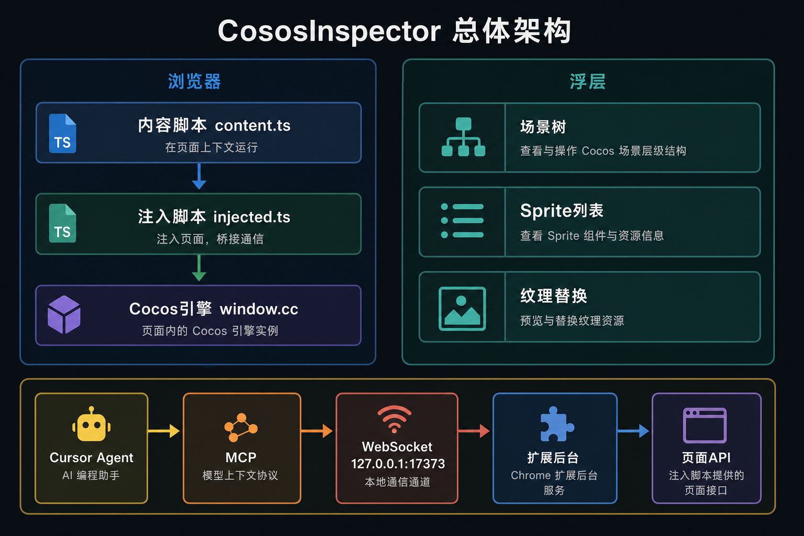
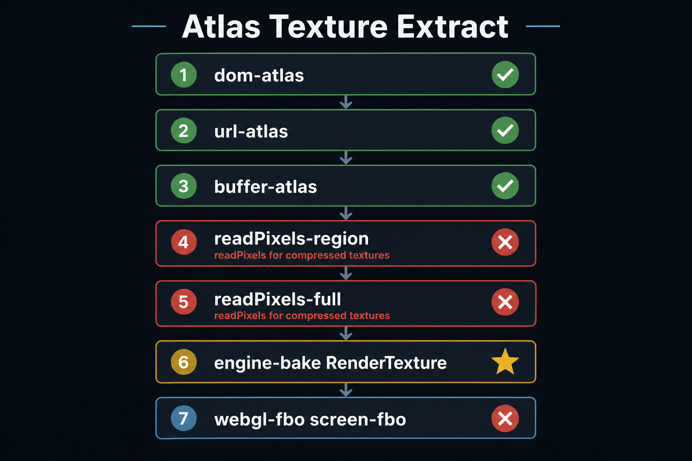
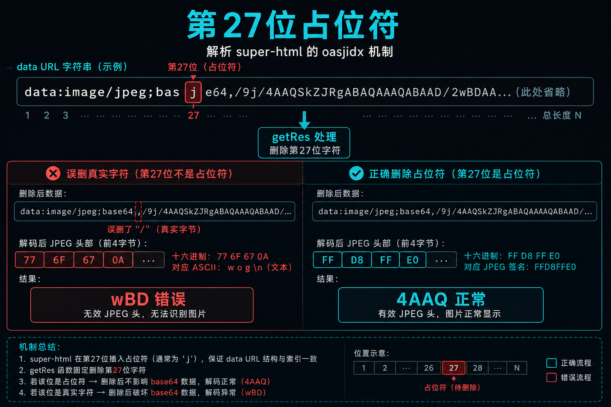
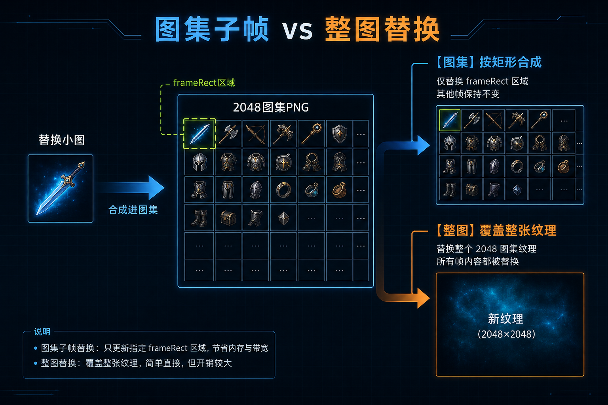
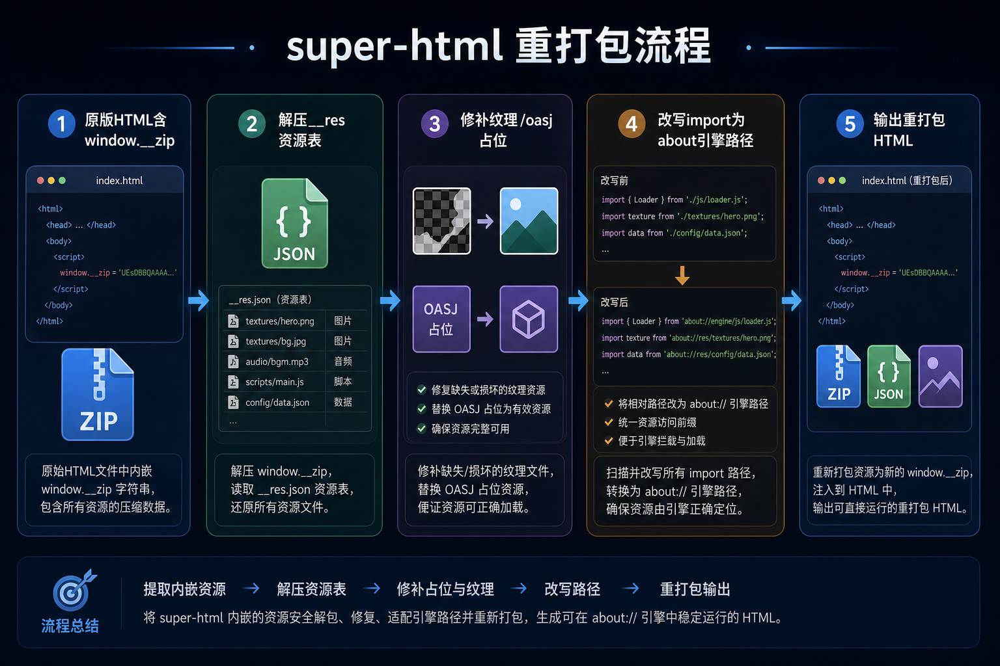
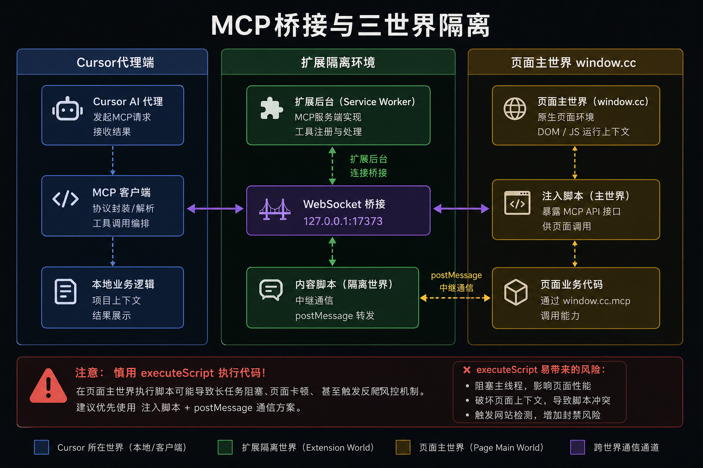

# CososInspector 难点技术（图示）

> 来源会话：[Cocos 3.x 升级与换皮](294854cf-e262-4c26-9fa1-aa5f0ce86b45)  
> 原则：**图为主、字为辅**（插图均为中文标注）

## 插图目录

| 图 | 文件 |
|----|------|
| ① 总体架构 | [`arch-extension-mcp-zh.png`](./images/arch-extension-mcp-zh.png) |
| ② 纹理提取瀑布 | [`texture-extract-waterfall.png`](./images/texture-extract-waterfall.png) ※英文版，中文版待补 |
| ③ oasjidx 占位 | [`oasjidx-mechanism-zh.png`](./images/oasjidx-mechanism-zh.png) |
| ④ 图集合成 | [`atlas-frame-composite-zh.png`](./images/atlas-frame-composite-zh.png) |
| ⑤ 重打包管线 | [`super-html-repack-pipeline-zh.png`](./images/super-html-repack-pipeline-zh.png) |
| ⑥ MCP 桥接 | [`mcp-bridge-isolation-zh.png`](./images/mcp-bridge-isolation-zh.png) |

---

## 1 总体架构



| 层 | 路径 |
|---|------|
| 注入 | `src/content.ts` → `src/injected.ts` |
| Cocos 3 | `src/cocos3/*` |
| 重打包 | `tools/repack-super-html.mjs` |
| MCP | `tools/mcp-cocos-inspector/` |

---

## 2 图集纹理提取（多路回退）



**难点**：ASTC 等压缩纹理 `readPixels` 常失败；`rect` / `rotated` / WebGL Y 轴易裁错。

**实现**：`src/cocos3/textureExtract.ts` · `textureBake.ts` · `textureWebGL.ts`

---

## 3 super-html：`oasjidx = 27`



| | 第 27 位 | `getRes()` 后 |
|--|---------|---------------|
| 原版 | 占位符 | `/9j/4AAQ…` ✅ |
| 误替换 | 真实 base64 | `/9j/wBD…` ❌ |

**实现**：`tools/repack-super-html.mjs` · `tools/repack-atlas-patch.mjs` → `applySuperHtmlOasjPlaceholder()`

---

## 4 图集子帧 vs 整图替换



| 模式 | 条件 | 行为 |
|------|------|------|
| `[图集]` | `frameRect` ≪ 整图 | sharp 合成进 native PNG |
| `[整图]` | 帧铺满纹理 | 覆盖整张 jpg/png |

**实现**：`tools/repack-atlas-patch.mjs` · manifest `frameRect` / `isRotated`

---

## 5 super-html 重打包管线



**附带约束**

- data URL 长度 ≤ 原版（约 255KB）
- 本地预览：`about:cocos-js/cc.js`（线上目录用 `--keep-import-map`）

---

## 6 MCP：三世界隔离 + WebSocket 桥



**难点**

- 扩展本身不能当 MCP Server，需 Node 伴生进程
- `executeScript` 易卡死 → **content 脚本中继** + `postMessage`
- MCP 进程退出会带走桥 → 先运行 **`npm run cocos-bridge`**
- **大图不走 WebSocket**：`tmp/mcp-share/` + HTTP `17374`；上传 `in/`、导出 `out/{prefix}/`、替换/下载只传路径

```powershell
npm run cocos-bridge   # 常驻桥接 127.0.0.1:17373
# 再在 Cursor 启用 cocos-inspector MCP
```

**API**：`window.__cocosInspectorApi` · `src/cocos3/mcpBridge.ts`

---

## 7 端到端换皮


| 阶段 | 模块 |
|------|------|
| 预览 | `spriteReplace.ts` |
| 导出 | `replacementExport.ts` |
| 重打包 | `repack-super-html.mjs` |
| Agent | `cocos_*` MCP · `run-trial.mjs` |

---

## 源码索引

```
src/cocos3/
  textureExtract.ts  textureBake.ts  textureWebGL.ts
  replacementMeta.ts  replacementExport.ts  mcpBridge.ts
tools/
  repack-super-html.mjs  repack-atlas-patch.mjs
  mcp-cocos-inspector/
    bridge-daemon.mjs  bridge-server.mjs  index.mjs
```
